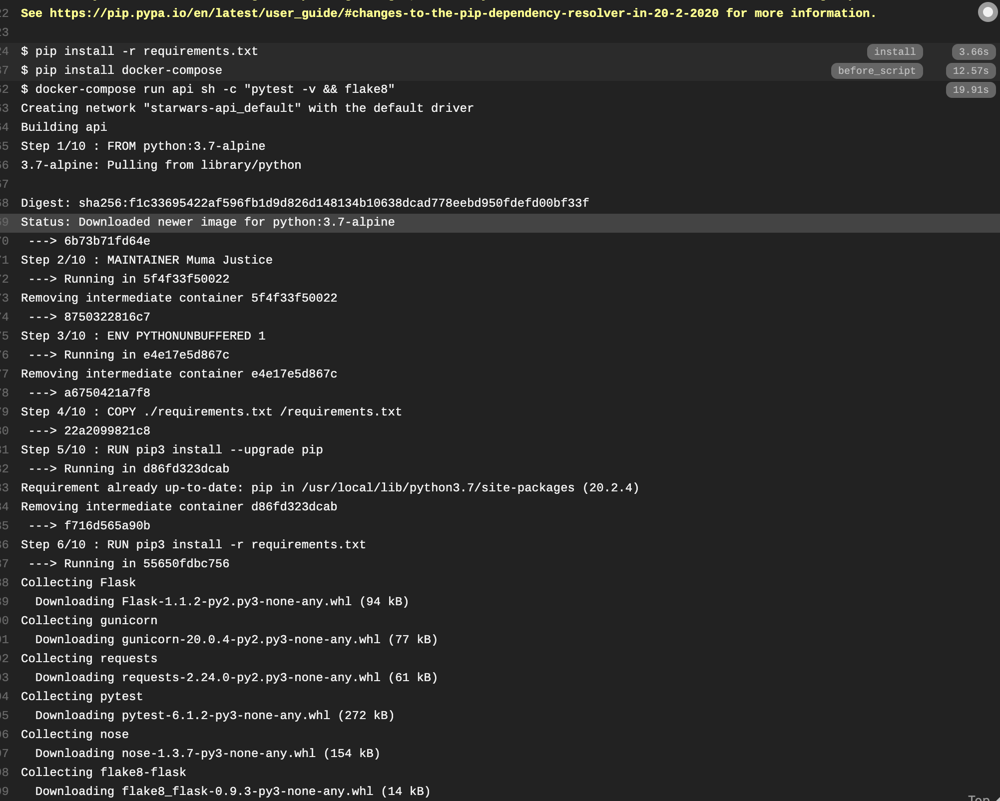

Starships API
-----

### Introduction

This is a mini api that fetches star ships from the official start ships api and sorts by current_hyperdrive_rating


### Tech Stack
This project is implemented with flask. It is ran in docker with docker-compose.
Therefore Tech stack includes:

* **Python3** and **Flask** as our server language and server framework
* **Docker and docker-compose** for creating and running schema migrations
* **pytest** for unit testing
* **flake8** for pep8 style enforcement

Builds are managed with [Travis CI](https://travis-ci.com/)

### Main Files: Project Structure

  ```sh
  ├── README.md
  ├── app.py *** the main driver of the app that inclues a route for fetching starships sorted by hyperdrive_rating.
  ├── config.py *** important requests urls. Other important app-wide settings can be placed here.
  ├── requirements.txt *** The dependencies we need to install with "pip3 install -r requirements.txt"
  ```

Instructions
-----


First, [install Flask](http://flask.pocoo.org/docs/1.0/installation/#install-flask) if you haven't already.

  ```
  $ cd ~
  $ sudo pip3 install Flask
  ```

To start and run the local development server,

1. Initialize and activate a virtualenv:
  ```
  $ cd YOUR_PROJECT_DIRECTORY_PATH/
  $ virtualenv --no-site-packages env
  $ source env/bin/activate
  ```

2. Install the dependencies:
  ```
  $ pip install -r requirements.txt
  ```

3. Run the development server:
  ```
  $ export FLASK_APP=wsgi
  $ export FLASK_ENV=development # enables debug mode
  $ python3 wsgi.py or flask run
  ```

4. Navigate to Home page [http://localhost:5000](http://localhost:5000)

To start the project in docker

1. Navigate to the root folder (one docker-compose and Dockerfile is located)
Type the following commands

```
1. docker-compose build 
1. docker-compose up
```

Then navigate to the app url.
You should see a welcome message 

To see the sorted starships 
visit [http://0.0.0.0:5000/starships](http://0.0.0.0:5000/starships)

### Deployment Instructions
Travis CI is used for Continuous Integration. Tests are automatically
rn and checks are done against pep8 before automatic deployment to heroku.

Below is a screen shot of a sample build from Travis CI.



[See live demo here](https://starships-api.herokuapp.com/starships)


